# 🌱 NatureSpots  

Discover and save peaceful nature spots near you.  
👉 [Live Demo](https://naturespots.onrender.com)  

---

## ✨ Features
- ✅ User authentication: register, login, logout (hashed passwords)  
- ✅ Add, edit, delete, and view Nature Spots (title, description, location, tags, image URL)  
- ✅ Save / Unsave favourite spots  
- ✅ Profile page (your spots + saved spots)  
- ✅ Inspiration page (quotes + images)  
- ✅ Search by keyword + filter by tag  
- ✅ Responsive UI with styled navbar, flash messages, and cards  
- ✅ SQLite database with SQLAlchemy ORM  
- ✅ Postgres database

---

## 🛠 Tech Stack
- Python 3, Flask, Jinja2  
- Flask-SQLAlchemy (SQLite)  
- Werkzeug security (password hashing)  
- HTML + CSS  
- Postgres

---

## 🖼️ Screenshots  

#### Login & Register  
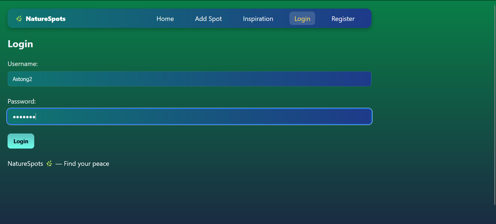
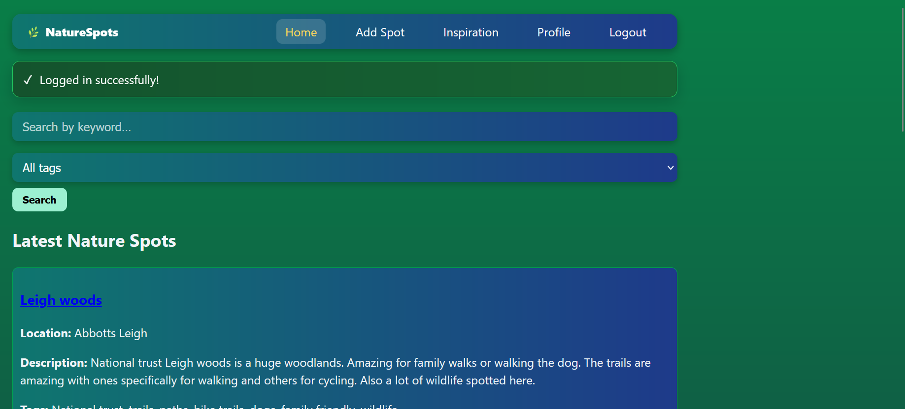
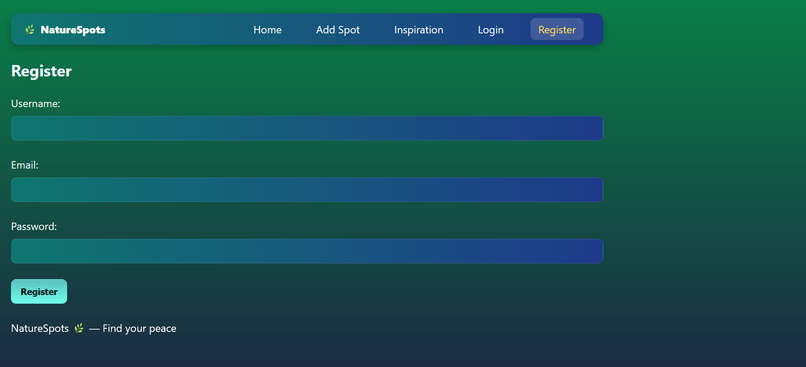  

#### Home  
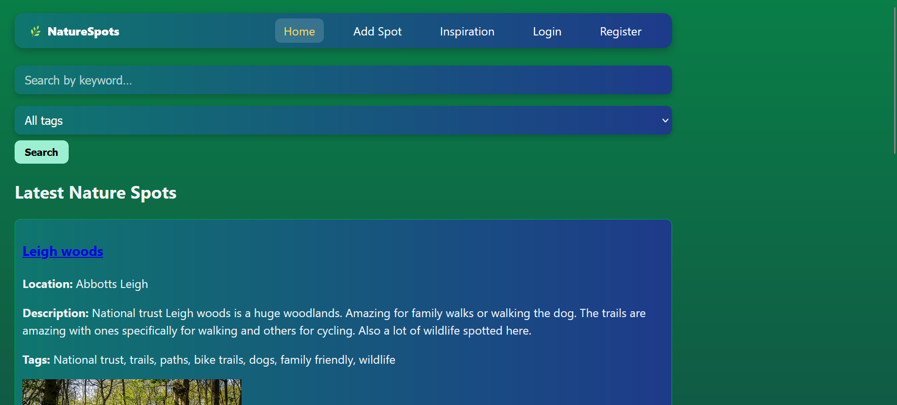

#### Profile  
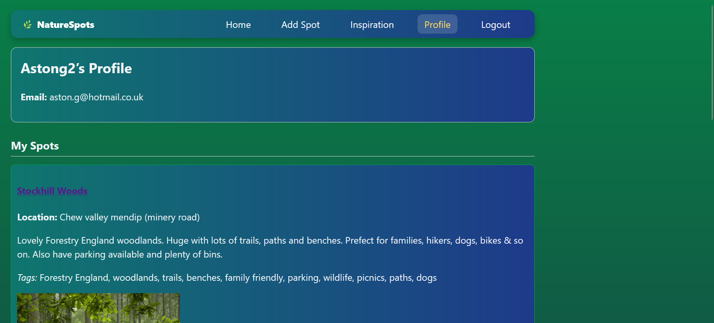  
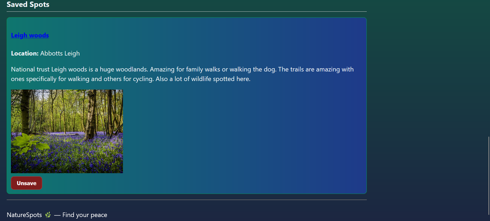

#### Add / Edit Spot  
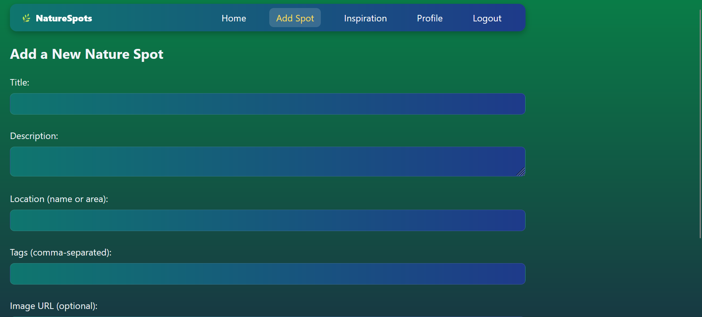 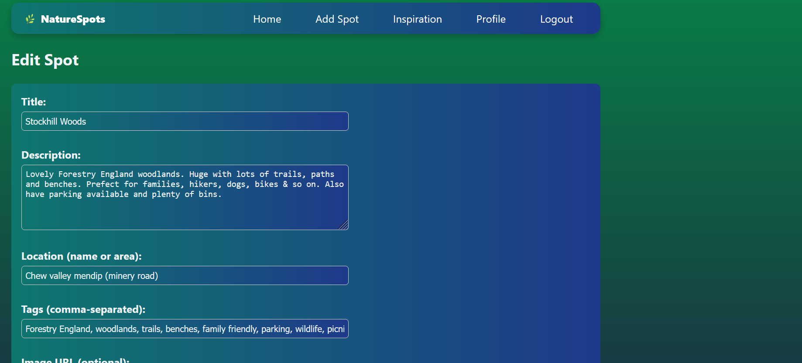  

#### Inspiration  
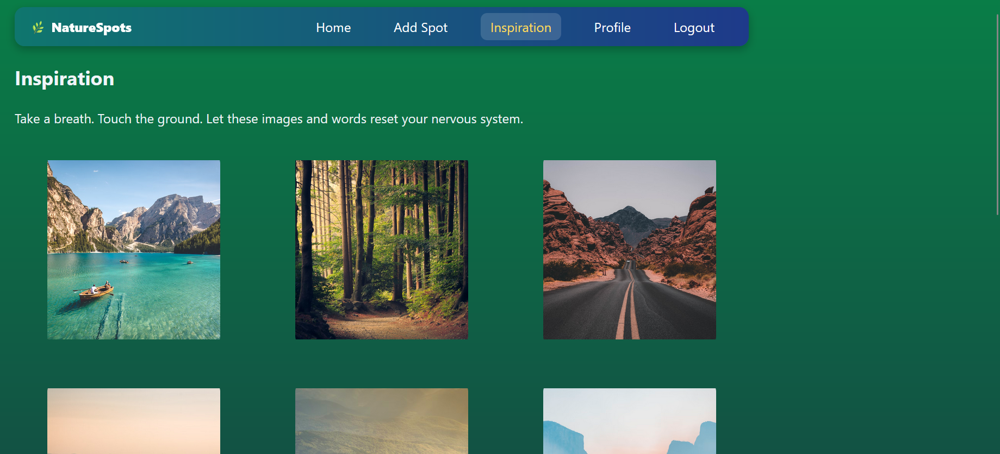 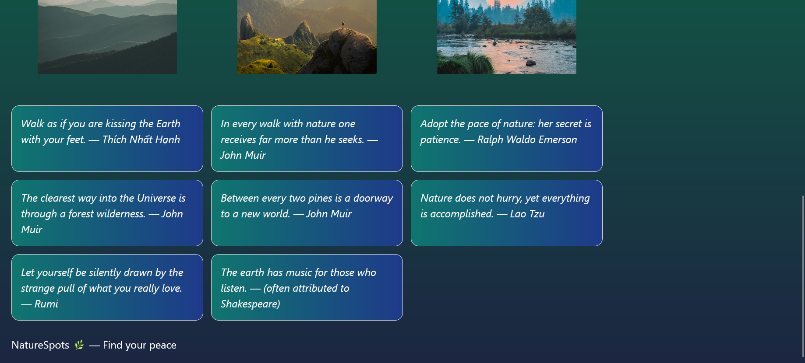  

#### Logout
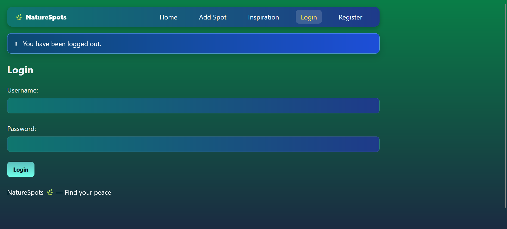

---

## 🚀 Setup (Run Locally)

Follow these steps to run NatureSpots on your local machine:  

1. Clone the repo  
   git clone https://github.com/astong2/NatureSpotsApp.git  
   cd NatureSpotsApp  

2. Create & activate a virtual environment  
   python -m venv venv  
   .\venv\Scripts\activate   # Windows  
   source venv/bin/activate # Mac/Linux  

3. Install dependencies  
   pip install -r requirements.txt  

4. Run database migrations (first time only)  
   python  
   >>> from app import app, db  
   >>> with app.app_context():  
   ...     db.create_all()  
   >>> exit()  

5. Start the app  
   python app.py  

---

## 🌍 Deployment

This project is deployed live on **Render**.  
👉 [Live Demo](https://naturespots.onrender.com)  

To deploy your own version:  
1. Push code to GitHub  
2. Connect repo to [Render](https://render.com)  
3. Add environment variable:  
   - SECRET_KEY=your-secret-key  
4. Set **Start Command** in Render:  
   gunicorn app:app --bind 0.0.0.0:$PORT  

---

## 👤 Author  

Built by **Aston Grant**  
- GitHub: [astong2](https://github.com/astong2)  
