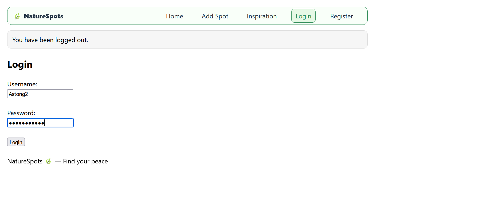
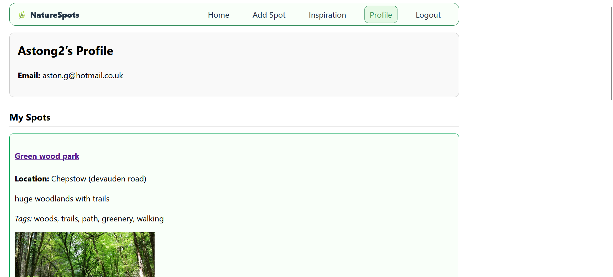
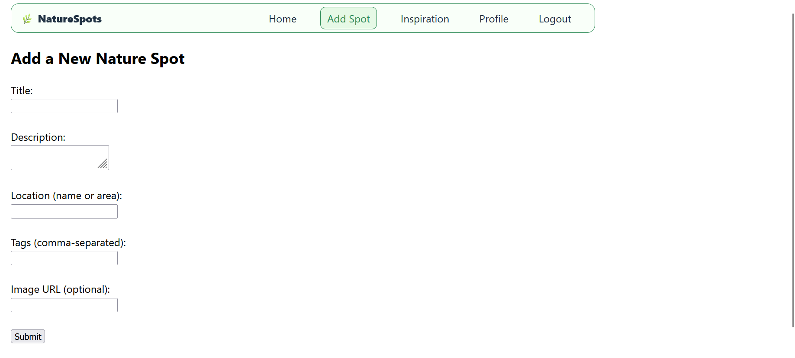
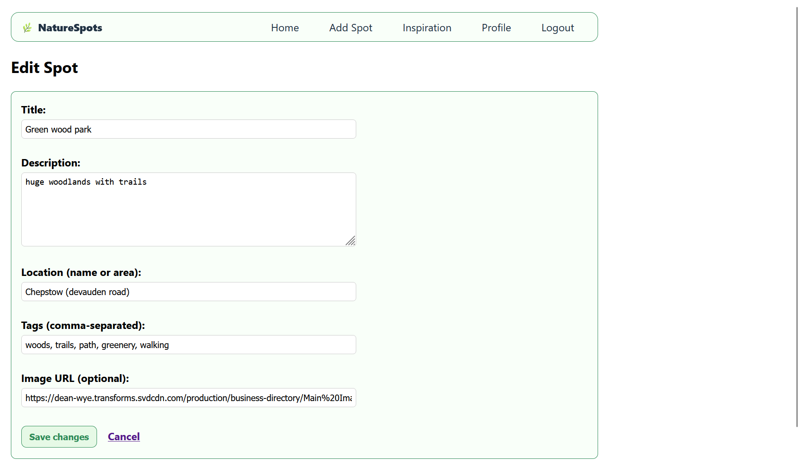

# 🌿 NatureSpots

Discover and save peaceful nature spots near you.  
A full-stack Flask app with user accounts, CRUD features, and a focus on simplicity.

## ✨ Features
- User authentication: register, login, logout (hashed passwords)
- CRUD for Nature Spots (title, description, location, tags, image URL)
- Save/Unsave favourite spots
- Profile page: view your spots + saved spots
- Spot detail pages
- Search by keyword + filter by tag
- Inspiration page (quotes + images)
- Styled UI: navbar, flash messages, responsive cards
- SQLite database with SQLAlchemy persistence

## 🛠 Tech Stack
- Python 3, Flask, Jinja2
- Flask-SQLAlchemy (SQLite)
- Werkzeug security (password hashing)
- HTML + CSS

## 📸 Screenshots

### Login


### Home
.png)
.png)

### Profile


### Spot Details



### Inspiration
.png)
.png)
            

## 🚀 Setup
```bash
git clone https://github.com/<your-username>/NatureSpotsApp.git
cd NatureSpotsApp
python -m venv venv
.\venv\Scripts\activate
pip install -r requirements.txt
python
>>> from app import app, db
>>> with app.app_context():
...     db.create_all()
>>> exit()
python app.py
